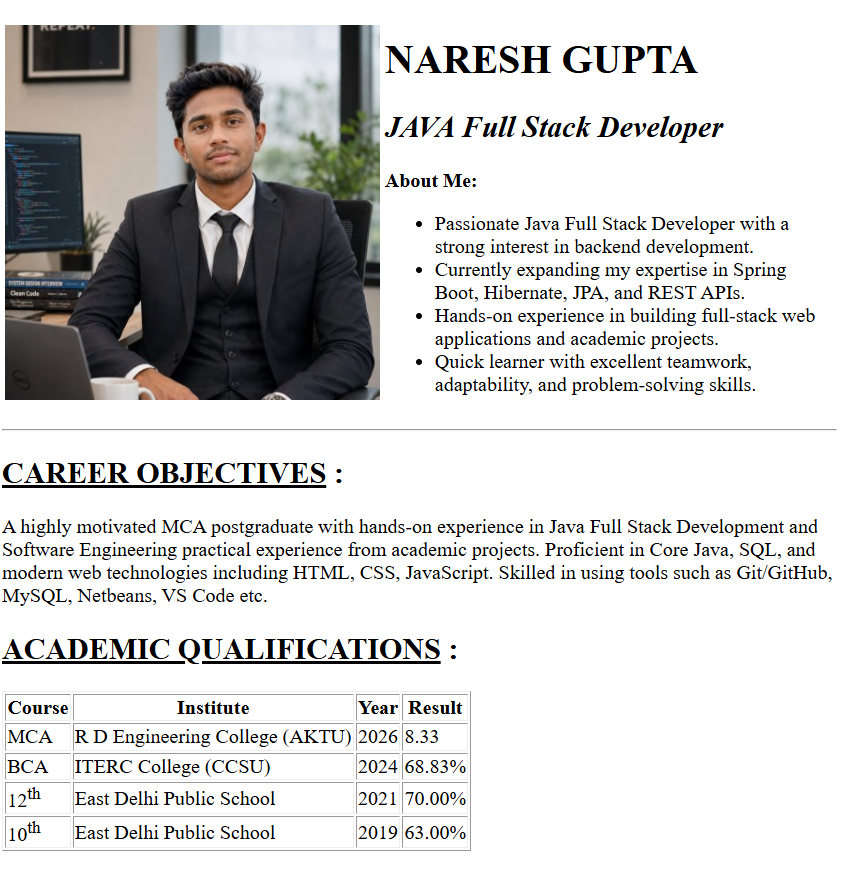
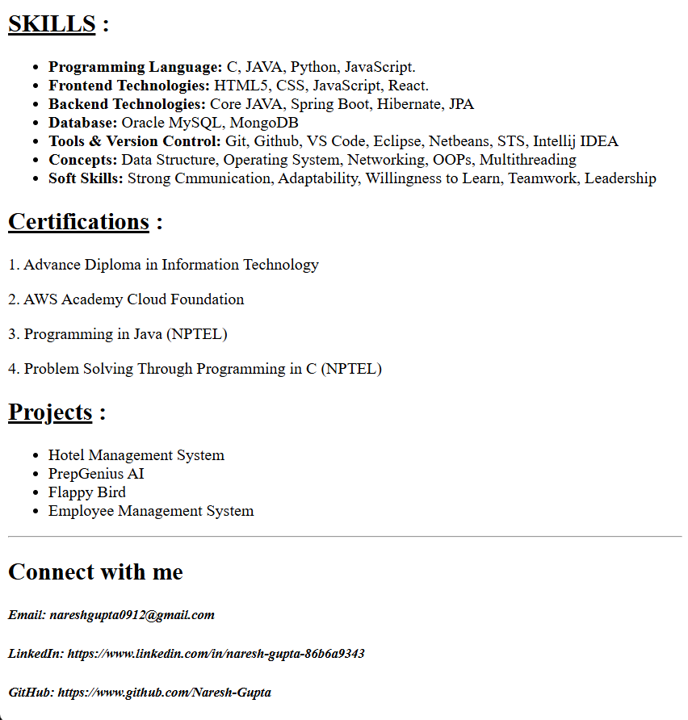

# HTML Resume

A personal resume webpage built using **pure HTML** to practice HTML fundamentals and semantic elements.

## 🌐 Live Demo

https://nareshgupta-resume.vercel.app/

## 📌 Project Overview

This project is a static resume webpage created without using CSS or JavaScript. It demonstrates the use of basic HTML elements to organize and present personal, educational, and professional information in a structured format.

## 🚀 Features

* Profile section with image and introduction
* Career objective
* Academic qualifications table
* Technical skills
* Certifications
* Projects section
* Contact information
* Clean and semantic HTML structure

## 🛠️ Technologies Used

* HTML5

## 📂 Project Structure

```text
html-resume-project/
│── index.html
│── NareshGupta.jpg
│── screenshots/
│   ├── Screenshot_1.png
│   ├── Screenshot_2.png
│── readme.md
```

## 📸 Screenshots

### Resume Page





## ▶️ How to Run

1. Clone the repository.
2. Open the project folder.
3. Double-click `index.html` or open it in your preferred web browser.

## 📚 Learning Outcomes

Through this project, I practiced:

* HTML document structure
* Semantic HTML
* Tables
* Lists
* Images
* Hyperlinks
* Headings and paragraphs
* Building a structured webpage using only HTML

## 📬 Contact

**Naresh Gupta**

* Email: [nareshgupta0912@gmail.com](mailto:nareshgupta0912@gmail.com)
* LinkedIn: https://www.linkedin.com/in/naresh-gupta-86b6a9343
* GitHub: https://github.com/Naresh-Gupta

---

⭐ If you found this project helpful, feel free to star the repository.
